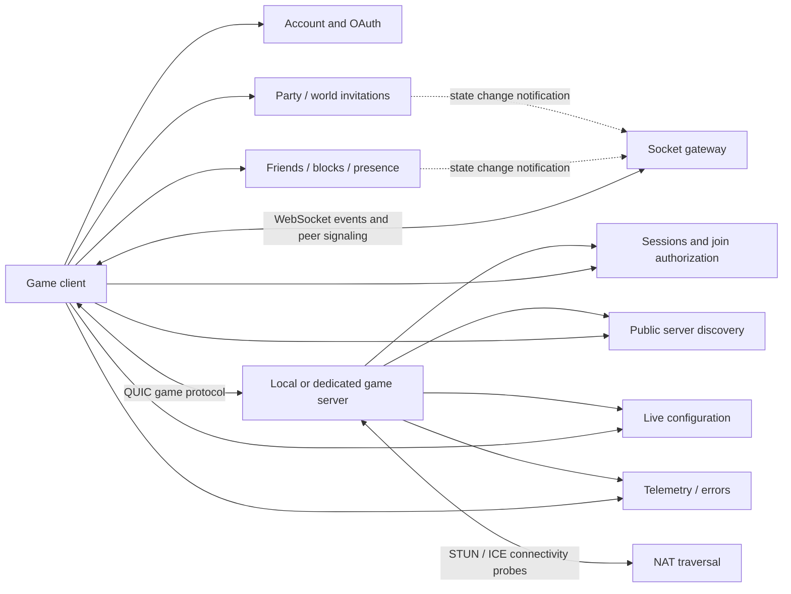

# Hytale backend: protocol map and implementation coverage

Investigation date: 2026-10-06. This is a map of the client-visible backend, not recovered central-server source. Static observations, runtime observations, and proposed implementation choices are distinguished below. Production was not modified during this investigation.

Detailed companion ledgers: [current client inventory](backend-client-inventory.txt), [peer field contract](backend-peer-contract.txt).

## Artifact identity and evidence

- Current supplied macOS arm64 client: `HytaleClient` SHA-256 `2dcf5b82172a972e32d19917fd0923a49d6e6f4d9b6caf5660e4dd66b97fefb6`. REA `inspect_macho` evidence `ev_ecb218198bf76f739ca09e0619c54044b0a90cfc5e5e54fbd9b1da2436d4fb0f`.
- Current server: release **0.6.8**, revision `d2feeb3997f2efc9b4fe23282a3ece38f0618047`, SHA-256 `dcd2956cc65b950084650eadd56b889cf51f7610c127c3daac1f74dc471fec97`. CFR 0.152 reconstructed 140 selected class entries into 74 Java files.
- Historical Windows client: **0.7.0-pre.4**, SHA-256 `df8f131432518a4363725852a11a2a1ac23fc1783cb5c463acaae07fb9884c5c`. Its native dispatch/JSON metadata provided the initial WebSocket contract. Do not treat its addresses as macOS addresses.
- Runtime evidence: the user's 2026-09-28 release 0.6.8 log confirms connection to `wss://auth.sanasol.ws/ws`, acceptance of `gateway.connected`, assignment of connection ID, successful solo-world entry and normal shutdown. It does **not** validate friend invitations or peer signaling.
- Local research evidence lives under the workspace `.temp/rea-hytale/`: `macho.json`, `server-identity.txt`, `server-findings.txt`, `server-negative-scan.json`, `server-decompiled/`, `auth-coverage.txt`. Historical native evidence is `.temp/socket-gateway-research/`. Proprietary binaries and reconstructed source are not committed here.

## Service map

The dotted state-change arrows are an architectural inference from REST operations and matching push-event names, not observed official internal queues. One executable can host several logical services; hostnames do not prove deployment topology.

## 1. Account, cosmetics, sessions and game authentication

The account service supplies identities, profiles, saved appearances and cosmetic ownership. It is separate from game-session authorization. A profile UUID is persistent player identity; a session token authorizes backend requests; an identity token is presented to another game participant. These are not interchangeable.

Confirmed from current server call sites:

| Service | Method/path | Request and response |
|---|---|---|
| OAuth accounts | authorization code + PKCE / device flow / refresh | Server OAuth client `hytale-server`, scopes `openid offline auth:server` |
| account-data | GET `/my-account/get-profiles` | OAuth bearer → `{owner,profiles:[{uuid,username}]}` |
| sessions | POST `/game-session/new` | OAuth bearer + `{uuid}` → `{sessionToken,identityToken,expiresAt}` |
| sessions | POST `/game-session/refresh` | Session bearer → refreshed session fields |
| sessions | DELETE `/game-session` | Session bearer |
| sessions | POST `/server-join/auth-grant` | Session bearer + `{identityToken,aud}` → `{authorizationGrant}` |
| sessions | POST `/server-join/auth-token` | Session bearer + `{authorizationGrant,x509Fingerprint}` → `{accessToken}` |
| sessions | GET `/.well-known/jwks.json` | Public signature-verification keys |
| account-data | GET `/profile/uuid/{uuid}` / `/profile/username/{encodedName}` | Bearer-authenticated individual profile lookup |

Game connection authentication is mutual:

1. Client sends its identity token over the game connection.
2. Server validates it, requests an authorization grant and returns `AuthGrant(grant, serverIdentityToken)`.
3. Client returns `AuthToken(accessToken, serverAuthorizationGrant)`.
4. Server validates client UUID, username, audience, signature, expiry and certificate binding; it exchanges the reverse grant bound to its own certificate.
5. Server sends `ServerAuthToken`; normal game loading can continue.

Evidence: reconstructed `server/core/io/handlers/login/HandshakeHandler.java:148,183,244,325`; `server/core/auth/JWTValidator.java:105`; `SessionServiceClient.java:67,102,205,238,278`.

Our implementation has real custom session/profile/skin storage and signed tokens. This does not establish equivalence with official OAuth or every official token rule. Cosmetic catalog returns all item IDs from installed Assets.zip without entitlement filtering.

## 2. Friends, blocks and presence

Client artifacts identify friend requests (incoming/outgoing, send by username, accept/reject), favorites, removal, blocks, Discord friend resolution, presence settings, heartbeat, appearing offline and joining a friend's world. Exact endpoint inventory is recorded separately from inferred HTTP semantics.

Observed push-event names: `friend.request.received`, `friend.request.accepted`, `friend.request.rejected`, `friend.presence.updated`, `friend.unfriended`, `friend.blocked`.

Expected state relationship (inference): a successful friend-request mutation changes persistent relationship state; matching notifications update the recipient's client. Presence heartbeat reports state; visibility settings and block/friend relationships determine what another player can see. An HTTP200 with an empty list cannot implement this.

Our source currently:
- Returns empty friends, requests, favorites, blocks and friend presence.
- Always returns404 for POST `/friend-requests/by-username`, including existing users.
- Stores `/presence/settings` and `/presence/heartbeat`, but does not compute online expiry or notify friends.
- Has no real friend accept/reject/block relationship state machine.

Unknown: complete request/response DTOs, pagination limits, duplicate-request behavior, privacy precedence, heartbeat TTL, notification ordering and replay guarantees. These require serializer/call-site tracing or a controlled two-account runtime capture.

## 3. Groups and world invitations

Client artifacts distinguish a **party** from a **world invitation**. Party membership is social state; accepting a world invitation initiates access to a particular running world.

Observed party events: `party.invite.received`, `party.invite.canceled`, `party.member.joined`, `party.member.left`, `party.leader.changed`.

Observed world events: `world.invite.received`, `world.invite.accepted`, `world.invite.rejected`, `world.invite.canceled`.

Our source returns empty invitations and404 `not in a party`; it does not persist invitations/membership or deliver any of these events. Party limits, leader transfer, expiry, cancellation races and world-access authorization remain unconfirmed.

## 4. WebSocket transport and peer signaling

Historical native call site `0x140b842e0` opens `/ws` under the socket-gateway base, with `Authorization: Bearer <session token>` and HytaleClient User-Agent. Dispatcher `0x140a17a80` recognizes:

- `gateway.connected` — data includes `connection_id` (JSON metadata `0x140a065d0`).
- `gateway.close` — closure information.
- `gateway.notification` — social/peer notification wrapper; wrapper fields `id`, `type`, `timestamp`, `data` recovered from initializer `0x140a06d80`; field types and delivery semantics remain to be verified.
- `peer.session.ack` and `peer.error` — peer-session replies.

Known peer command/event names: `peer.session.open`, `peer.send`, `peer.session.close`, `peer.session.opened`, `peer.message`, `peer.session.closed`. Error metadata `0x140a0c290` identifies `code`, `message`, `session_id`, `client_ref`.

Recovered peer DTO fields (historical Windows0.7.0-pre.4, not a release0.6.8 compatibility claim):

| Message | Data fields | Property initializer |
|---|---|---|
| `peer.session.open` | `peer_uuid`, `kind`, `client_ref` | `0x140a113c0` |
| `peer.send` | `session_id`, `seq`, `payload` | `0x140a0df60` |
| `peer.session.close` | `session_id` | `0x140a10180` |
| `peer.session.ack` | `session_id`, `peer_online`, `client_ref` | `0x140a0ee00` |
| notification `peer.session.opened` | `session_id`, `from_uuid`, `kind` | `0x140a10930` |
| notification `peer.message` | `session_id`, `from_uuid`, `seq`, `payload` | `0x140a0d060` |
| notification `peer.session.closed` | `session_id`, `reason` | `0x140a0f950` |

Caller `0x140b8ca90` corroborates open-request peer UUID/kind/client reference; `0x1409ea270` sends peer payload; `0x140a19820` parses sender UUID and indexes local sessions by session ID. Property spellings/counts are stronger evidence than inferred DTO type labels. Do not invent requiredness, timestamp format, sequence numeric width or supported kinds. The notification dispatcher also handles `chat` and Discord link/unlink events.

Our deployed stub implements a valid upgrade, initial connection ID and ping/pong. It replies to peer operations with `peer.error` and the locally invented code `unsupported`; that code is **not** recovered official behavior. It has no recipient UUID routing, session relay or connection to social state. Real-client handshake success therefore proves only transport/hello compatibility.

Historical client code explicitly logs fallback to racing candidates when ICE signaling is refused. This is static evidence of a fallback path, not proof that it works for every network/NAT.

## 5. Joining a friend's local world

The server reveals the receiving half of peer setup:

1. Host client owns a singleplayer server.
2. Clients obtain peer connectivity parameters through a signaling channel (gateway relationship inferred from the client peer/ICE handlers).
3. Host client sends game packet `ConfigureIcePeer` with local/remote `ufrag`, passwords and remote host/port candidates.
4. Local server accepts this packet **only from the world owner in singleplayer**, validates credentials/candidates and registers ICE probing.
5. STUN/ICE attempts connectivity through NAT. The established game session uses QUIC and the mutual authentication above.

Current server: `ConfigureIcePeer` packet254; ufrag length4–256, password22–256; STUN default `stun.cloudflare.com:3478`, keepalive15s, probe budget10s. Evidence: `GamePacketHandler.java:702`, `IceCredentials.java:29`, `IceModule.java:274`, `IceResponder.java:41`.

Gateway signaling is not itself a game-packet relay. TURN/relay fallback availability, invitation-to-peer binding and all failure codes are unconfirmed.

## 6. Discovery, live configuration and telemetry

- Server discovery: POST `/servers/heartbeat`, bearer session + `{discoveryToken,serverPatchline,serverVersion,protocolVersion}`, success204; first heartbeat after20s then every60s. Recognized errors:404 TOKEN_NOT_FOUND,403 PROFILE_MISMATCH. Listing management/token issuance are not in this server artifact.
- Liveconfig: GET `/server-configs/{patchline}?os&arch&version`, session bearer and ETag/If-None-Match;304 retains snapshot. JSON `{version,flags:{key:{type,value}}}`, supported boolean/integer/string; refresh300s. Failure preserves old configuration.
- Server telemetry: POST `/telemetry/server`, session bearer. Telemetry failure is separate from successful game authentication.
- Client also exposes listing/search and interaction routes, account Discord linking and error reporting. Do not confuse Discord account-link notifications with Discord voice or in-game proximity voice.

Our discovery adapts Santale rather than maintaining the official directory. Static source still permits `createdAt:null`, and passes no user UUID to `getListings(url)`, losing the per-user interaction overlay. `/me/interactions` returns501. These explain the previously observed discovery failures; they are not gateway failures.

## Implementation gaps and next verification order

1. Establish exact release-client DTOs for batch profiles, server listings and `/me/interactions`; fix malformed responses before expanding features.
2. Implement and verify a vertical friend flow with two test users: send → incoming list/event → accept → both lists/presence → remove/block. Tests must verify stored state and both clients, not only HTTP status.
3. Connect gateway sockets to verified user identities and social state-change delivery. Determine multiple sessions, disconnect handling and privacy filtering.
4. Add party/world invitations with recovered schemas and explicit lifecycle tests.
5. Implement peer-session routing, then test one actual join across separate networks. Preserve direct-connect behavior.

This is an implementation proposal, not observed official server internals. No speculative database schema, queue topology or reliability guarantees are asserted.

## Known source defects outside social stubs

See `src/app.js`, `src/routes/social.js`, `src/routes/serverDiscovery.js` and the local evidence ledger:
- Release client contains exact `/profile/uuids` at file offset `0x22c25ce`. Generic profile fallback returns a single profile object where that client expects required `profiles` for batch lookup.
- Broad `/session` routing shadows the later DELETE `/game-session` branch.
- Unknown paths may get generic success/token JSON, masking missing protocol handlers.
- Social/liveconfig flags can advertise features whose server implementation is still a stub.

## Coverage checklist

- [x] Identify exact current client/server artifacts.
- [x] Reconstruct server-side session and mutual-auth flow.
- [x] Explain HTTP / notifications / signaling / QUIC separation.
- [x] Inventory current implementation vs stubs.
- [x] Establish owner-only ICE configuration and discovery/liveconfig consumers.
- [ ] Recover every release-client DTO/method/error and WebSocket wrapper field.
- [ ] Observe real two-user social state changes, reconnect and NAT traversal.
- [ ] Confirm central-server state transitions and delivery semantics; binary strings alone cannot prove them.

## REA setup on this workstation

REA CLI4.0.1 and its bundled `reverse-engineer-anything` skill are installed. Codex MCP registration is in `~/.codex/config.toml`; restart Codex to load it into new tool sessions. Existing unrelated MCP entries were preserved by setup.

Ghidra12.1.4 is under `~/.local/share/rea/ghidra_12.1.4_PUBLIC`, using the installed Homebrew JDK21. Its official archive omitted a macOS decompiler; the shipped C++ source was compiled for arm64 (`make ghidra_opt ARCH_TYPE='-arch arm64' ADDITIONAL_FLAGS='-mmacosx-version-min=12.0 -w'`) and installed as `Ghidra/Features/Decompiler/os/mac_arm_64/decompile`. No game binaries were modified.

For direct CLI, export `GHIDRA_INSTALL_DIR` and `JAVA_HOME` as configured in the MCP registration. The scoped `rea doctor --provider ghidra` check passes with these variables. REA CLI commands are isolated: each opens and closes its provider session; use MCP for successive deep queries to avoid reanalyzing the same binary for every command. Evidence snapshots cache results, not a persistent live Ghidra session.

REA limitation observed on this artifact: the full macOS NativeAOT autoanalysis exceeded the provider's330-second startup deadline (`provider_timeout`, operation `list_segments`). Ghidra emitted address-space/decompiler warnings before timeout. `inspect_macho` and plist inspection succeed; a complete REA decompilation of the game is not claimed. Use targeted native inspection or a saved, pre-analyzed database for subsequent work; increasing a timeout alone is not evidence of correctness.

Provider installation smoke check passed: REA/Ghidra decompiled a locally compiled arm64 test function correctly (argc>2 returns7, otherwise0), evidence `ev_90784ec68288110c5064c13a85f0ab9c29f6871de71ee41aaee2c7f1887847b6`. This tests the toolchain, not game protocol compatibility.
